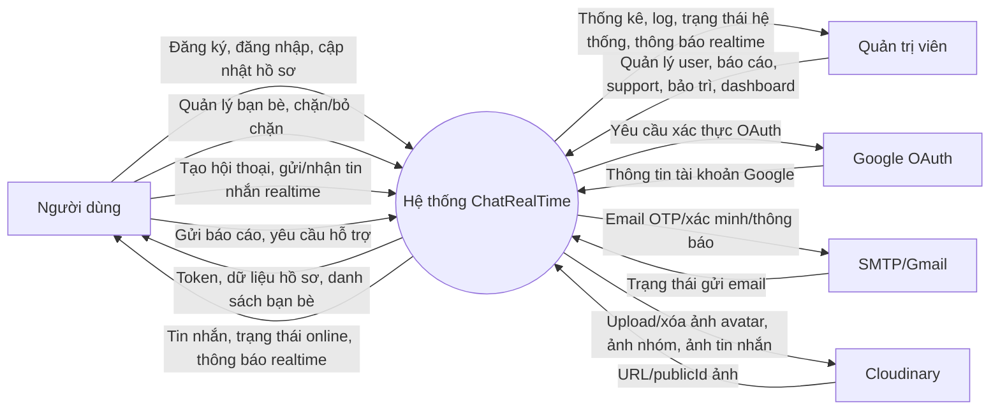
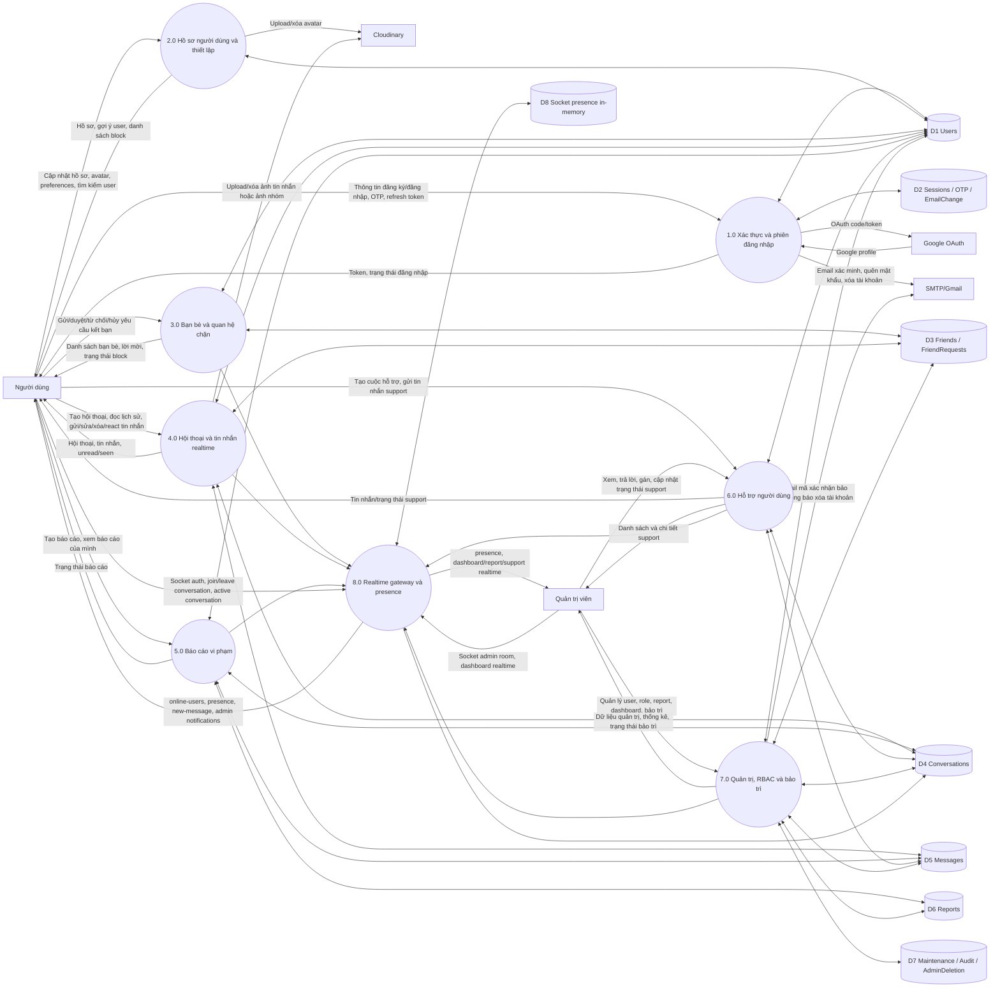
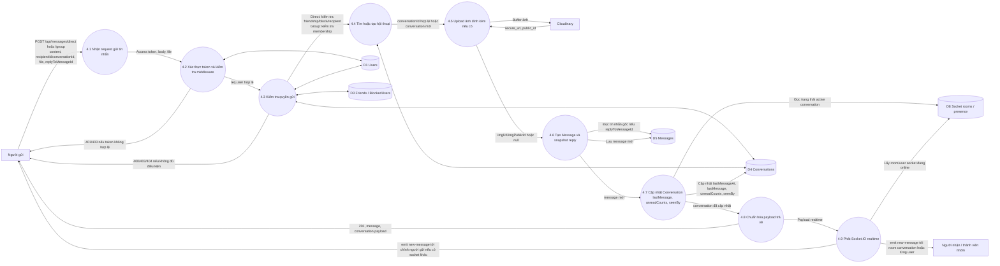

# DFD ChatRealTime

Các biểu đồ dưới đây được viết bằng Mermaid, dựa trên backend Express, MongoDB và Socket.IO trong thư mục `backend/src`.

## 1. DFD mức ngữ cảnh

## 2. DFD mức 1 của hệ thống

## 3. DFD mức 2: chức năng gửi tin nhắn realtime

## Ghi chú ánh xạ backend

- Route gửi tin nhắn: `backend/src/modules/chat/api/http/message.route.js`.
- Controller gửi tin nhắn: `backend/src/modules/chat/api/http/message.controller.js`.
- Service nghiệp vụ gửi/lưu/phát tin: `backend/src/modules/chat/application/message.command-service.js`.
- Realtime emitter: `backend/src/modules/chat/infrastructure/realtime/message-realtime.js`.
- Socket.IO init, rooms, presence: `backend/src/app/socket/initSocket.js`.
- Kho dữ liệu chính: `User`, `Conversation`, `Message`, `Friend`, `FriendRequest`, `Report` trong `backend/src/models`.
