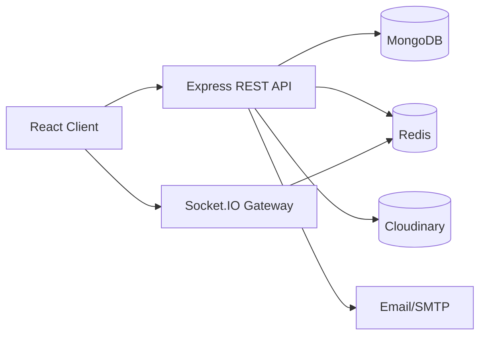
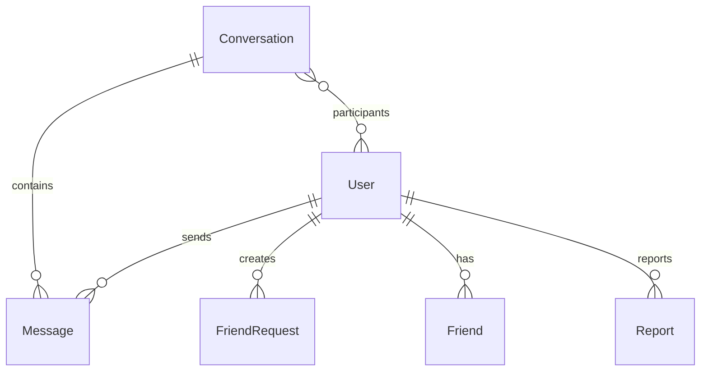
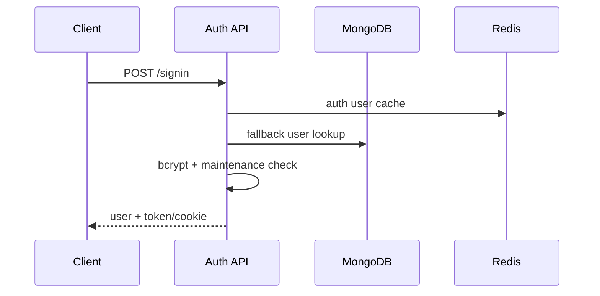
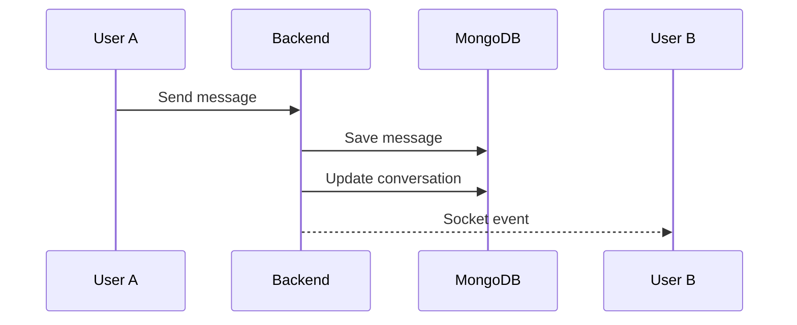

# Outline PowerPoint bảo vệ đồ án ChatRealTime

## Slide 1. Tiêu đề đồ án

- ChatRealTime - Ứng dụng chat thời gian thực
- Sinh viên thực hiện, giảng viên hướng dẫn
- Công nghệ chính: React, Node.js, MongoDB, Socket.IO, Redis

Gợi ý hình ảnh/sơ đồ: ảnh giao diện chat hoặc mockup màn hình chính.

Speaker notes: Em giới thiệu tên đề tài, mục tiêu chung là xây dựng ứng dụng chat realtime có xác thực, nhắn tin, quản lý bạn bè, admin và tối ưu backend.

## Slide 2. Lý do chọn đề tài

- Nhu cầu giao tiếp realtime ngày càng phổ biến
- Chat không chỉ là gửi tin nhắn mà còn cần presence, notification, bảo mật
- Đề tài giúp vận dụng cả frontend, backend, database và realtime
- Có cơ hội phân tích hiệu năng thực tế

Gợi ý hình ảnh/sơ đồ: icon luồng giao tiếp realtime giữa nhiều người dùng.

Speaker notes: Em chọn đề tài vì hệ thống chat có phạm vi đủ rộng để thể hiện kiến thức tổng hợp, đồng thời có nhiều vấn đề kỹ thuật thật như socket, bảo mật và performance.

## Slide 3. Mục tiêu hệ thống

- Xây dựng ứng dụng chat 1-1 và chat nhóm
- Hỗ trợ đăng ký, đăng nhập, xác thực JWT
- Gửi/nhận tin nhắn và thông báo realtime
- Quản lý bạn bè, report và admin panel
- Tối ưu bảo mật và hiệu năng backend

Gợi ý hình ảnh/sơ đồ: checklist mục tiêu.

Speaker notes: Mục tiêu không phải tạo một app thương mại hoàn chỉnh, mà là xây dựng nền tảng chat có đủ chức năng chính và có phân tích kỹ thuật rõ ràng.

## Slide 4. Chức năng chính

- Người dùng: auth, profile, friend, chat, report
- Realtime: message, notification, online/offline
- Admin: user management, report management, maintenance
- Call: voice/video signaling nếu bật chức năng calls

Gợi ý hình ảnh/sơ đồ: sơ đồ nhóm chức năng theo 3 vùng User, Realtime, Admin.

Speaker notes: Em chia chức năng thành ba nhóm để hội đồng dễ theo dõi: chức năng người dùng, realtime và quản trị.

## Slide 5. Tech stack

- Frontend: React, Zustand, Tailwind/Radix UI
- Backend: Node.js, Express.js
- Database: MongoDB/Mongoose
- Realtime: Socket.IO
- Cache/scale: Redis, ioredis, Socket.IO Redis adapter

Gợi ý hình ảnh/sơ đồ: bảng logo công nghệ hoặc stack diagram.

Speaker notes: Stack được chọn vì phù hợp với ứng dụng realtime JavaScript full-stack, dễ tích hợp Socket.IO và MongoDB.

## Slide 6. Kiến trúc tổng thể

- React Client gọi REST API và kết nối Socket.IO
- Express xử lý nghiệp vụ và xác thực
- MongoDB lưu dữ liệu chính
- Redis hỗ trợ cache, rate limit, session và realtime adapter
- Cloudinary/SMTP hỗ trợ media và email

Gợi ý hình ảnh/sơ đồ: dùng mermaid kiến trúc tổng thể.

Speaker notes: REST API xử lý nghiệp vụ thông thường, Socket.IO xử lý realtime, MongoDB lưu dữ liệu chính và Redis giảm tải hoặc đồng bộ realtime giữa worker.

## Slide 7. Thiết kế database

- User lưu tài khoản, role, status và profile
- Conversation quản lý direct/group/support
- Message lưu nội dung, reply, reaction, call metadata
- Friend/FriendRequest quản lý quan hệ bạn bè
- Report, Session, Maintenance phục vụ quản trị và auth

Gợi ý hình ảnh/sơ đồ: dùng mermaid ERD rút gọn.

Speaker notes: Thiết kế tập trung vào Conversation và Message. Participant nằm trong Conversation để biết user nào thuộc hội thoại nào.

## Slide 8. Luồng đăng nhập/xác thực

- Client gửi username/password
- Backend lookup user và so sánh bcrypt
- Kiểm tra trạng thái user và maintenance
- Tạo access token, refresh token và cookie
- Frontend dùng token/cookie cho API và socket

Gợi ý hình ảnh/sơ đồ: dùng mermaid sequence đăng nhập.

Speaker notes: Luồng đăng nhập là phần được tối ưu nhiều nhất. Em vẫn giữ contract auth hiện có để tránh làm vỡ frontend.

## Slide 9. Luồng gửi tin nhắn realtime

- Client tạo message
- Backend kiểm tra quyền trong conversation
- Lưu message vào MongoDB
- Cập nhật lastMessage/unreadCounts
- Emit event tới room conversation/user

Gợi ý hình ảnh/sơ đồ: dùng mermaid sequence message.

Speaker notes: Tin nhắn vẫn được lưu DB trước, sau đó mới emit realtime để dữ liệu có nguồn chính xác.

## Slide 10. Socket.IO và realtime event

- User join room riêng theo userId
- Socket join room conversation
- Event: message, friend, notification, admin, call
- Presence xử lý connect/disconnect
- Phase 2A thêm Redis adapter và Redis presence bằng flag

Gợi ý hình ảnh/sơ đồ: room model user room và conversation room.

Speaker notes: Socket.IO giúp gửi event đúng người hoặc đúng phòng. Khi mở rộng nhiều worker, Redis adapter giúp event đi qua các process khác nhau.

## Slide 11. Bảo mật hệ thống

- JWT access token và refresh token
- HttpOnly cookie, Bearer flow trong memory
- CORS whitelist cho API và Socket.IO
- HTTPS enforcement production
- Helmet/security headers

Gợi ý hình ảnh/sơ đồ: lớp bảo vệ quanh API.

Speaker notes: Phase 1 bảo mật tập trung vào transport security. Một số điểm như refresh token rotation và CSP vẫn là hướng phát triển tiếp theo.

## Slide 12. Vấn đề hiệu năng ban đầu

- Valid login chậm hơn invalid/fake user
- Login hợp lệ đi qua nhiều bước hơn
- Có thể nghẽn ở user lookup, bcrypt, maintenance hoặc session
- Cần đo từng đoạn thay vì đoán

Gợi ý hình ảnh/sơ đồ: pipeline login với các bước đo timing.

Speaker notes: Vấn đề chính là p95 login tăng khi load test. Em không tối ưu ngay mà thêm công cụ đo để xác định nút thắt.

## Slide 13. Quá trình đo và tìm bottleneck

- k6 đo p95, failed, timeout
- SigninPipelineTiming đo từng đoạn login
- PerfMonitor đo CPU/event loop
- Mongo monitor đo pool và query
- Benchmark riêng cho user lookup và bcrypt

Gợi ý hình ảnh/sơ đồ: bảng các công cụ đo và chỉ số.

Speaker notes: Mỗi công cụ trả lời một câu hỏi khác nhau: request chậm ở đâu, Node có nghẽn không, Mongo có nghẽn không, bcrypt có phải nguyên nhân chính không.

## Slide 14. Tối ưu Redis auth user lookup cache

- Cache user lookup theo normalized username
- Chỉ cache user local, verified, active
- Không cache negative result
- Có invalidation khi đổi password, verify, lock/unlock, role update
- Cache hit giúp `userLookupAwaitMs` giảm còn khoảng 0.7-3ms

Gợi ý hình ảnh/sơ đồ: cache-aside flow Redis -> Mongo fallback.

Speaker notes: Đây là phase quan trọng vì user lookup là bottleneck lớn. Cache có rủi ro vì chứa hashedPassword nên em dùng TTL ngắn, opt-in và không log payload.

## Slide 15. Tối ưu maintenance L1 cache

- Sau Phase 1I, bottleneck chuyển sang maintenance read
- Thêm L1 in-memory cache per worker
- Thêm single-flight chống cache stampede trong worker
- Không đổi logic maintenance
- Còn eventual consistency ngắn trong multi-worker

Gợi ý hình ảnh/sơ đồ: L1 memory -> Redis L2 -> MongoDB.

Speaker notes: L1 cache giúp request phổ biến đọc maintenance gần như tức thời. Tuy nhiên nếu L1 miss và rơi xuống Mongo thì vẫn có thể còn timeout.

## Slide 16. Kết quả load test

- Phase 1E: 50 VUs p95 khoảng 2.09s
- Phase 1I: 25 VUs p95 khoảng 146ms, failed 0%
- Phase 1I: 50 VUs p95 khoảng 272-406ms nhưng còn timeout nhỏ
- Phase 1J: 40 VUs p95 khoảng 256ms, failed khoảng 3.24%
- Phase 1J: 50 VUs p95 khoảng 275ms, failed khoảng 2.23%

Gợi ý hình ảnh/sơ đồ: biểu đồ cột p95 theo phase; ghi chú rõ failed còn lại.

Speaker notes: Kết quả tốt hơn rõ nhưng em không kết luận hệ thống chịu tải hoàn hảo. Cách nói đúng là p95 đã cải thiện, nhưng còn timeout nhỏ cần tối ưu tiếp.

## Slide 17. Hạn chế và hướng phát triển

- Load test local Windows khác production Linux
- 40/50 VUs vẫn còn timeout nhỏ
- Chưa có Prometheus/Grafana
- Chưa có BullMQ cho job nền
- Cần smoke đầy đủ Phase 2A Redis Socket.IO adapter/presence

Gợi ý hình ảnh/sơ đồ: roadmap Phase 2.

Speaker notes: Em trình bày hạn chế trung thực và roadmap rõ: hoàn thiện realtime scale, cache read-heavy API, queue background jobs và monitoring production.

## Slide 18. Kết luận

- ChatRealTime đáp ứng chức năng chính của app chat realtime
- Có kiến trúc frontend/backend/database/realtime rõ ràng
- Có bảo mật truyền tải cơ bản
- Có quy trình đo tải và tối ưu theo số liệu
- Còn hướng phát triển để tiến gần production

Gợi ý hình ảnh/sơ đồ: tổng hợp 4 trụ cột: Function, Realtime, Security, Performance.

Speaker notes: Điểm mạnh của đồ án là không chỉ có chức năng chat, mà còn có phần kỹ thuật backend: bảo mật, Redis, profiling và tối ưu hiệu năng.
