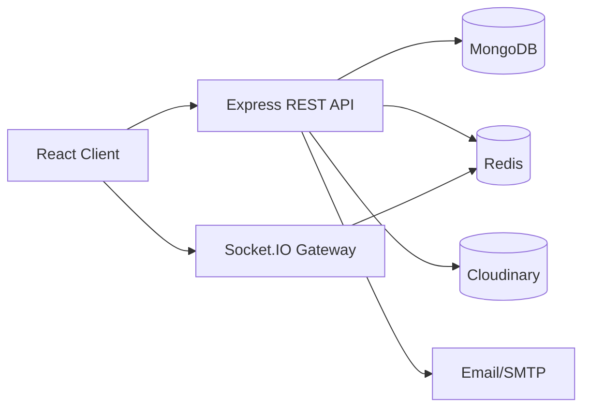

# Báo cáo kỹ thuật đồ án tốt nghiệp ChatRealTime

## 1. Giới thiệu đề tài

ChatRealTime là ứng dụng chat thời gian thực, tập trung vào nhu cầu giao tiếp trực tuyến giữa người dùng cá nhân, nhóm và hệ thống quản trị. Trong các ứng dụng hiện đại, người dùng không chỉ cần gửi tin nhắn, mà còn cần trạng thái online/offline, thông báo tức thời, quản lý bạn bè, báo cáo vi phạm và khả năng trao đổi đa phương tiện.

Lý do chọn đề tài ChatRealTime là vì hệ thống chat realtime có phạm vi vừa đủ rộng để thể hiện nhiều mảng kỹ thuật: xây dựng giao diện người dùng, thiết kế API backend, lưu trữ dữ liệu, xác thực, bảo mật, realtime socket, cache, kiểm thử tải và tối ưu hiệu năng.

Mục tiêu của hệ thống:

- Xây dựng ứng dụng chat realtime hỗ trợ chat 1-1 và chat nhóm.
- Hỗ trợ đăng ký, đăng nhập, đăng xuất và xác thực người dùng bằng JWT.
- Hỗ trợ gửi và nhận tin nhắn tức thời qua Socket.IO.
- Hỗ trợ trạng thái online/offline và thông báo realtime.
- Hỗ trợ quản lý bạn bè, lời mời kết bạn, báo cáo và quản trị hệ thống.
- Nâng cao bảo mật truyền tải và hiệu năng backend bằng Redis/cache.

## 2. Phạm vi chức năng

### 2.1. Người dùng

Nhóm chức năng người dùng bao gồm:

- Đăng ký, đăng nhập, đăng xuất và làm mới phiên đăng nhập.
- Quản lý hồ sơ cá nhân, ảnh đại diện, thông tin hiển thị và tùy chọn online.
- Gửi, hủy, chấp nhận hoặc từ chối lời mời kết bạn.
- Chat 1-1 với bạn bè.
- Tạo và tham gia chat nhóm.
- Xem trạng thái online/offline của người dùng khác.
- Nhận thông báo realtime liên quan đến tin nhắn, bạn bè, cuộc trò chuyện và hệ thống.
- Báo cáo người dùng, tin nhắn hoặc cuộc trò chuyện khi có nội dung không phù hợp.
- Gọi thoại/video realtime nếu chức năng WebRTC được bật trong phần calls.

### 2.2. Realtime

Realtime được triển khai chủ yếu bằng Socket.IO:

- Client kết nối socket sau khi đăng nhập.
- Socket được xác thực bằng access token.
- Mỗi user join room riêng theo `userId`.
- Mỗi socket join các room conversation mà user tham gia.
- Server emit các sự kiện tin nhắn, conversation, friend, notification, admin và call signaling.
- Presence online/offline được quản lý theo socket connect/disconnect.
- Phase 2A đã bổ sung Redis Socket.IO adapter và Redis-backed presence bằng env flag, giúp chuẩn bị mở rộng nhiều worker/process.

### 2.3. Admin

Nhóm chức năng admin bao gồm:

- Quản lý danh sách người dùng.
- Khóa, mở khóa hoặc thay đổi trạng thái tài khoản.
- Quản lý vai trò và quyền.
- Quản lý báo cáo vi phạm.
- Theo dõi dashboard, health/performance nội bộ.
- Quản lý maintenance mode, trong đó admin được bypass còn user thường có thể bị chặn khi hệ thống bảo trì.

## 3. Kiến trúc tổng thể hệ thống

Hệ thống được chia thành các tầng chính:

- Frontend React/Vite xử lý giao diện, trạng thái client và kết nối API/socket.
- Backend Node.js/Express xử lý REST API, xác thực, nghiệp vụ và tích hợp Socket.IO.
- MongoDB/Mongoose lưu dữ liệu chính như user, conversation, message, friend, report và session.
- Redis/ioredis dùng cho cache, rate limit, refresh session hỗ trợ, maintenance cache, auth user lookup cache và realtime adapter/presence ở Phase 2A.
- Cloudinary dùng cho ảnh/avatar hoặc media upload nếu cấu hình trong môi trường triển khai.
- Email/SMTP dùng cho xác thực email, OTP hoặc các luồng thông báo liên quan tài khoản.

REST API xử lý các nghiệp vụ thông thường như đăng nhập, quản lý bạn bè, lấy danh sách hội thoại, gửi báo cáo và quản trị. Socket.IO xử lý realtime event như tin nhắn mới, presence, notification và call signaling. MongoDB là nguồn dữ liệu chính. Redis được đưa vào theo từng phase để giảm độ trễ ở các đường nóng, giới hạn tần suất request nhạy cảm và chuẩn bị mở rộng realtime. Cluster server hỗ trợ chạy nhiều worker trong môi trường dev/load test.

## 4. Tech stack sử dụng

| Nhóm | Công nghệ | Vai trò |
| --- | --- | --- |
| Frontend | React, Vite, TypeScript | Xây dựng giao diện người dùng |
| State management | Zustand | Quản lý state client |
| UI | Tailwind CSS, Radix UI/shadcn-style components, lucide-react | Xây dựng giao diện và component |
| Backend | Node.js, Express.js | REST API và nghiệp vụ backend |
| Realtime | Socket.IO, socket.io-client | Gửi/nhận sự kiện realtime |
| Realtime scale | @socket.io/redis-adapter | Fan-out socket event giữa nhiều worker/process |
| Database | MongoDB, Mongoose | Lưu user, message, conversation và dữ liệu nghiệp vụ |
| Cache/session/rate limit | Redis, ioredis | Cache, rate limit, refresh session hỗ trợ, presence |
| Auth | JWT, HttpOnly cookie, Bearer token | Xác thực và phân quyền |
| Security | Helmet, CORS whitelist, HTTPS middleware | Bảo mật truyền tải và header |
| Media | Cloudinary, multer | Upload ảnh/avatar/media |
| Email | nodemailer | Gửi email xác thực/OTP |
| Load test | k6 | Đo hiệu năng đăng nhập |
| Monitoring nội bộ | PerfMonitor, SigninPipelineTiming, MongoPoolMonitor | Phân tích bottleneck |
| Validation | Zod | Kiểm tra dữ liệu đầu vào |

## 5. Thiết kế dữ liệu

### User

`User` lưu thông tin tài khoản, xác thực và hồ sơ người dùng.

- Trường quan trọng: `userName`, `email`, `hashedPassword`, `authProvider`, `googleId`, `emailVerified`, `displayName`, `role`, `roles`, `permissions`, `status`, `avatarUrl`, `preferences.showOnlineStatus`, `blockedUsers`.
- Quan hệ: liên kết với Message, Conversation participant, Friend, FriendRequest, Report, Session.
- Index hiện có: `userName` unique, `email` unique, `googleId` unique sparse. Nên bổ sung index phục vụ admin filter/search nếu dữ liệu lớn.

### FriendRequest

`FriendRequest` lưu lời mời kết bạn.

- Trường quan trọng: `from`, `to`, `message`, `status`.
- Quan hệ: `from` và `to` đều tham chiếu User.
- Index hiện có: `status`, unique `{ from, to }`, index `{ from }`, `{ to }`.

### Friend

`Friend` lưu quan hệ bạn bè đã được chấp nhận.

- Trường quan trọng: `userA`, `userB`.
- Quan hệ: cả hai trường tham chiếu User.
- Index hiện có: unique `{ userA, userB }`. Trước khi lưu, hệ thống sắp xếp hai ObjectId để tránh lưu trùng A-B và B-A.

### Conversation

`Conversation` lưu cuộc trò chuyện direct, group hoặc support.

- Trường quan trọng: `type`, `participants`, `group`, `lastMessageAt`, `lastMessage`, `seenBy`, `unreadCounts`, `clearedFor`, `supportStatus`, `assignedAdminId`.
- Quan hệ: participant tham chiếu User; lastMessage liên quan Message.
- Index hiện có: `{ "participants.userId": 1, lastMessageAt: -1 }`, `{ type: 1, supportStatus: 1, lastMessageAt: -1 }`, `{ supportCreatedByUserId: 1, type: 1 }`, `{ assignedAdminId: 1, supportStatus: 1 }`.

### Participant

Participant là subdocument trong Conversation, không phải collection riêng.

- Trường quan trọng: `userId`, `joinedAt`.
- Vai trò: xác định thành viên của direct/group/support conversation.
- Quan hệ: `userId` tham chiếu User.

### Message

`Message` lưu nội dung tin nhắn và metadata.

- Trường quan trọng: `conversationId`, `senderId`, `senderDisplayName`, `content`, `imgUrl`, `replyTo`, `reactions`, `callMetadata`, `deletedFor`, `isDeletedForEveryone`, `editedAt`.
- Quan hệ: thuộc Conversation, sender tham chiếu User, replyTo tham chiếu Message.
- Index hiện có: `conversationId`, `{ conversationId: 1, createdAt: -1 }`, phù hợp phân trang tin nhắn theo hội thoại.

### Report

`Report` lưu báo cáo vi phạm.

- Trường quan trọng: `reporterId`, `targetType`, `targetUserId`, `targetMessageId`, `targetConversationId`, `reason`, `description`, `status`, `reviewedByAdminId`, snapshot tại thời điểm báo cáo.
- Quan hệ: liên kết User, Message hoặc Conversation tùy target.
- Index hiện có: `reporterId`, `targetType`, target ids, `status`, `{ status: 1, createdAt: -1 }`, `{ reporterId: 1, createdAt: -1 }`, `{ targetType: 1, status: 1 }`.

### Maintenance

`Maintenance` lưu trạng thái bảo trì.

- Trường quan trọng: `isEnabled`, `message`, `enabledBy`, `enabledAt`, `disabledBy`, `disabledAt`, các hash xác nhận nội bộ.
- Quan hệ: admin bật/tắt maintenance tham chiếu User.
- Cache: public fields được cache Redis L2 và L1 in-memory ở Phase 1J; không cache các hash xác nhận.

### Session và refresh session

`Session` lưu refresh token truyền thống trong MongoDB.

- Trường quan trọng: `userId`, `refreshToken`, `expiresAt`.
- Quan hệ: `userId` tham chiếu User.
- Index hiện có: `userId`, `refreshToken` unique, TTL `{ expiresAt: 1 }`.
- Redis Phase 1B/Redis phase tạo helper hash refresh token và key `session:refresh:{sha256(refreshToken)}`; không lưu raw token trong Redis. Tuy nhiên cần phân biệt: MongoDB Session vẫn là nguồn chính trong một số luồng, tùy flag triển khai.

### CallSession

`CallSession` hỗ trợ voice/video call.

- Vai trò: lưu thông tin phiên gọi, trạng thái ringing/active/ended/failed và participant.
- Quan hệ: liên kết User, Conversation và Message qua call metadata.
- Hạn chế: Phase 2A chưa chuyển toàn bộ orchestration call state sang Redis; vẫn còn một số Map local cho busy/ringing timeout.

## 6. Thiết kế xác thực và bảo mật

Hệ thống sử dụng JWT để xác thực. Access token có TTL ngắn và được set trong HttpOnly cookie; refresh token dùng để cấp access token mới. Frontend vẫn có Bearer flow trong memory state để gọi API và socket auth, nhưng không persist access token vào localStorage.

Các thành phần chính:

- JWT access token.
- Refresh token.
- HttpOnly cookie cho `accessToken` và `refreshToken`.
- Bearer token trong Authorization header cho luồng hiện có.
- Middleware xác thực API và socket.
- Role/permission cho admin panel.

Transport Security Phase 1 đã triển khai:

- Cookie helper dùng chung cho set/clear cookie.
- CORS whitelist cho Express và Socket.IO, không dùng wildcard với credentials.
- HTTPS enforcement ở production có rollback flag.
- `trust proxy` khi chạy production.
- Helmet/security headers như HSTS production, `X-Frame-Options: DENY`, `X-Content-Type-Options: nosniff`, `Referrer-Policy`, `Permissions-Policy`.
- Production env validation cho frontend/backend URL.

Những điểm cố ý chưa thay đổi ở Phase 1:

- Chưa bỏ `accessToken` khỏi JSON response.
- Chưa bỏ Authorization Bearer flow.
- Chưa rotate refresh token.
- Chưa bật CSP vì cần tránh làm vỡ Swagger, Socket.IO, Cloudinary preview và voice/video call.

Khi bảo vệ hệ thống, cần giữ ổn định contract auth response, cookie name và Bearer flow trong lúc tối ưu performance để không làm vỡ frontend hiện có.

## 7. Thiết kế realtime bằng Socket.IO

Sau khi đăng nhập, client kết nối Socket.IO và gửi token trong `auth.token`, không truyền token qua query string. Server xác thực socket qua middleware, sau đó:

- Join room riêng theo `userId`.
- Join room `admins` nếu user có quyền admin.
- Join các room conversation mà user đang tham gia.
- Đăng ký handler cho message, conversation, notification, friend và call.

Luồng gửi tin nhắn:

1. Client gửi request hoặc socket event tạo message.
2. Backend kiểm tra quyền tham gia hội thoại.
3. Backend lưu message vào MongoDB.
4. Backend cập nhật conversation như `lastMessage`, `unreadCounts`, `seenBy`.
5. Backend emit message/conversation update tới room conversation hoặc user room.
6. Client nhận realtime update và cập nhật giao diện.

Presence online/offline:

- Trước khi mở rộng, presence chủ yếu dựa trên Map local theo socket connect/disconnect.
- Khi chạy nhiều worker, Map local dễ lệch trạng thái giữa các process.
- Phase 2A đã bổ sung Redis-backed presence và Socket.IO Redis adapter bằng các flag `SOCKET_REDIS_ADAPTER_ENABLED` và `PRESENCE_REDIS_ENABLED`.
- Redis adapter giúp emit tới room/user xuyên worker; Redis presence giúp online users không chỉ phụ thuộc vào một process.

Hạn chế còn lại của realtime:

- Manual multi-tab/cluster smoke cho Phase 2A chưa được ghi nhận là đã chạy đầy đủ.
- Call orchestration vẫn còn một số state local trong `call.service.js`; Redis adapter hỗ trợ signaling xuyên worker nhưng chưa biến toàn bộ call state thành distributed state hoàn chỉnh.

## 8. Tối ưu hiệu năng Phase 1

### 8.1. Vấn đề ban đầu

Đường `POST /api/auth/signin` của user hợp lệ bị chậm khi load test. Một điểm đáng chú ý là fake/invalid user có thể phản hồi nhanh hơn valid login vì valid login đi qua nhiều bước hơn: lookup user, bcrypt compare, maintenance check, tạo session, set cookie và emit event.

Mục tiêu tối ưu là không đoán nguyên nhân bằng cảm giác, mà tách pipeline đăng nhập thành từng đoạn để biết bottleneck thật nằm ở đâu.

### 8.2. Công cụ đo

Các công cụ được dùng trong quá trình phân tích:

- k6 để đo request duration, p90/p95, failure rate và timeout.
- `SigninPipelineTiming` để đo từng đoạn login service.
- `PerfMonitor` để theo dõi CPU, event loop utilization, event loop delay và memory.
- Mongo driver/pool monitor để quan sát checkout, pending checkout, command duration.
- Benchmark user lookup riêng để so sánh query Mongo/Mongoose.
- Benchmark bcrypt concurrency để kiểm tra chi phí CPU-bound.

### 8.3. Các chỉ số đo

- `avg`: thời gian trung bình.
- `median`: trung vị, phản ánh request điển hình.
- `p90`, `p95`: 90% hoặc 95% request nhanh hơn mốc này; dùng để nhìn tail latency.
- `http_req_failed`: tỷ lệ request lỗi hoặc timeout trong k6.
- `VUs`: virtual users, số user ảo đồng thời.
- `request timeout`: request vượt timeout cấu hình, thường là dấu hiệu tail latency hoặc nghẽn tài nguyên.
- `userLookupAwaitMs`: thời gian chờ Mongo/Redis lookup user.
- `bcryptMs`: thời gian so sánh mật khẩu.
- `maintenanceReadMs`: thời gian đọc trạng thái maintenance.
- `createSessionMs`: thời gian tạo access/refresh token, lưu session và set cookie.

### 8.4. Phase 1B - Redis refresh session

Phase 1B tập trung vào refresh session Redis:

- Vấn đề: login thành công tạo session mới trong MongoDB, có thể tăng áp lực ghi khi load test nhiều login.
- Thiết kế Redis session dùng key dựa trên hash refresh token, không lưu raw refresh token.
- Có flag để bật/tắt và rollback.
- MongoDB Session vẫn được giữ để giảm rủi ro thay đổi contract và hỗ trợ fallback.

Ý nghĩa của phase này là đặt nền cho việc giảm phụ thuộc vào MongoDB ở hot path auth, nhưng chưa giải quyết triệt để user lookup, bcrypt hoặc maintenance read.

### 8.5. Phase 1C-1H - Profiling chi tiết

Các phase profiling đã đi qua nhiều giả thuyết:

- Kiểm tra index `userName` và xác nhận truy vấn signin có đường dùng index.
- Giảm payload user lookup bằng `.select()`.
- Tinh chỉnh Mongo pool qua env để benchmark linh hoạt.
- Đo Node process saturation bằng PerfMonitor.
- Đo cluster dev để xem nhiều worker có cải thiện tail latency không.
- Đo pipeline signin để biết request chậm nằm ở đoạn nào.
- Benchmark user lookup standalone cho thấy pool 25/50 ở concurrency 50 có p95 khoảng 186-190ms, còn pool 10 có thể nghẽn rõ hơn.
- Mongo driver monitor cho thấy trong request thật vẫn có lúc `userLookupAwaitMs` tăng mạnh, nên user lookup trong valid login là bottleneck quan trọng ở thời điểm đó.

Kết luận trung gian: bcrypt vẫn là chi phí CPU đáng kể, nhưng không phải nguyên nhân duy nhất. Khi valid login chậm, user lookup/Mongo và sau đó maintenance read đều cần được đo riêng.

### 8.6. Phase 1I - Redis Auth User Lookup Cache

Phase 1I thêm Redis cache cho user lookup theo username trong signin.

Thiết kế chính:

- Cache mặc định tắt, chỉ bật khi `AUTH_USER_LOOKUP_CACHE_ENABLED=true`, `REDIS_ENABLED=true`, `CACHE_ENABLED=true`.
- Cache chỉ áp dụng cho user local, verified và active.
- Không cache negative result để tránh stale khi user mới được tạo hoặc thay đổi trạng thái.
- Payload cache là subset cần cho login, bao gồm `hashedPassword` để bcrypt compare.
- Có invalidation khi đổi password, verify email, đổi email/profile, admin lock/unlock, role update, ban/unban/delete account.
- Redis lỗi hoặc miss thì fallback MongoDB, không làm fail login.

Rủi ro và giảm thiểu:

- Cache chứa `hashedPassword`, nên chỉ bật opt-in, TTL ngắn, Redis private/password/TLS khi cần, không log payload hoặc key nhạy cảm.
- Key theo normalized username có thể nhạy cảm, nên helper không log raw key.

Kết quả theo report/log:

- Request đầu tiên miss cache, request sau hit cache.
- Khi cache hit, `userLookupAwaitMs` thường giảm về khoảng 0.7-3ms.
- Với 25 VUs, p95 khoảng 146ms và failed 0% theo số liệu tổng hợp trong yêu cầu.
- Với 40-50 VUs, p95 có thể xuống dưới 500ms nhưng vẫn còn timeout nhỏ do bottleneck khác.

### 8.7. Phase 1J - Maintenance L1 Cache + Single-flight

Sau Phase 1I, bottleneck chuyển sang `maintenanceReadMs`. Log chậm cho thấy có lúc `maintenanceReadMs` lên 2300-4900ms khi L1 chưa có hoặc khi source rơi xuống Redis/Mongo.

Phase 1J thêm:

- L1 in-memory cache per worker cho public maintenance config.
- Single-flight trong mỗi worker để giảm cache stampede khi nhiều request cùng miss.
- Đọc maintenance public config một lần trong flow login thay vì có nguy cơ đọc lặp.
- Invalidation khi admin toggle/update maintenance: xóa L1 worker hiện tại và Redis L2.

Business logic không đổi:

- Admin vẫn bypass maintenance.
- User thường vẫn bị chặn khi maintenance bật.
- Response maintenance vẫn dùng `503` và code `MAINTENANCE_MODE`.
- Không đổi auth response, cookie, Bearer flow, refresh token hoặc Redis session.

Kết quả theo report/log:

- Khi `maintenanceL1Hit=true`, `maintenanceReadMs` giảm xuống gần như tức thời.
- Một số timeout còn lại xảy ra khi L1 miss và source rơi xuống Redis/Mongo.
- Kết quả k6 tổng hợp sau Phase 1J: 40 VUs p95 khoảng 256ms nhưng còn khoảng 3.24% failed/timeout; 50 VUs p95 khoảng 275ms nhưng còn khoảng 2.23% failed/timeout.

Kết luận trung thực: Phase 1J cải thiện request phổ biến và giảm tail latency, nhưng chưa triệt để 100% timeout. Hướng xử lý tiếp theo là tăng TTL hợp lý, stale-while-revalidate, Redis pub/sub invalidation hoặc tiếp tục tách các bottleneck còn lại.

## 9. Bảng tổng hợp kết quả load test

| Giai đoạn | Cấu hình | VUs | p95 | Failed | Nhận xét |
| --- | --- | ---: | ---: | ---: | --- |
| Phase 1E | Cluster/dev benchmark tổng hợp trong report | 10 | khoảng 147ms | Không ghi rõ trong report | 10 VUs phản hồi tốt |
| Phase 1E | Cluster/dev benchmark tổng hợp trong report | 25 | khoảng 913ms | Không ghi rõ trong report | Tail latency tăng khi concurrency cao hơn |
| Phase 1E | Cluster/dev benchmark tổng hợp trong report | 50 | khoảng 2.09s | Không ghi rõ trong report | Cần profiling sâu hơn, chưa đạt mục tiêu p95 thấp |
| Trước Redis auth user cache | Cluster + Mongo user lookup | 50 | khoảng 1.4-2.0s theo tổng hợp yêu cầu | Có lỗi/timeout | User lookup/Mongo là bottleneck lớn |
| Sau Phase 1I | Redis auth user lookup cache | 25 | khoảng 146ms | 0% | Cache user lookup hiệu quả |
| Sau Phase 1I | Redis auth user lookup cache | 50 | khoảng 272-406ms | Còn timeout nhỏ | Bottleneck chuyển sang maintenance |
| Sau Phase 1J | Auth cache + maintenance L1 cache | 40 | khoảng 256ms | khoảng 3.24% | p95 đạt mục tiêu nhưng còn timeout khi L1 miss/source Mongo |
| Sau Phase 1J | Auth cache + maintenance L1 cache | 50 | khoảng 275ms | khoảng 2.23% | p95 tốt hơn, nhưng chưa thể gọi là hoàn hảo |

Lưu ý: các kết quả trên là kết quả trong môi trường local/dev load test, không được diễn giải thành “hệ thống chịu tải 50 VUs hoàn hảo”. Cách nói đúng là p95 dưới 500ms ở một số cấu hình, nhưng vẫn còn timeout nhỏ cần tối ưu tiếp.

## 10. Đánh giá kết quả đạt được

Đồ án đã hoàn thành các mục tiêu chính của một ứng dụng chat realtime:

- Có frontend và backend tách biệt.
- Có đăng ký, đăng nhập, xác thực JWT và cookie.
- Có chat 1-1, chat nhóm, conversation/message model.
- Có realtime messaging, notification, presence và call signaling.
- Có quản lý bạn bè, report/support và admin panel.
- Có bảo mật truyền tải Phase 1: CORS whitelist, HTTPS enforcement, Helmet/security headers, cookie helper.
- Có Redis cho cache, rate limit, maintenance cache, auth user lookup cache và chuẩn bị realtime scale.
- Có quy trình đo tải, phân tích bottleneck và tối ưu theo số liệu thay vì tối ưu cảm tính.
- Có Phase 2A cho Socket.IO Redis adapter và Redis-backed presence, dù vẫn cần manual smoke đầy đủ.

## 11. Hạn chế còn lại

- Load test chủ yếu chạy trong môi trường local Windows/cluster dev, có thể khác production Linux.
- 40/50 VUs vẫn còn timeout nhỏ ở một số cấu hình.
- Maintenance L1 cache trong multi-worker có eventual consistency theo TTL; Phase 1J chưa dùng Redis pub/sub invalidation cho L1.
- Phase 2A Redis Socket.IO adapter/presence đã thêm bằng flag nhưng manual multi-tab/cluster smoke chưa chạy đầy đủ.
- Call orchestration vẫn còn một số state local; Redis adapter hỗ trợ signaling xuyên worker nhưng chưa thay thế toàn bộ call state.
- Chưa có full observability như Prometheus/Grafana.
- Chưa có BullMQ cho email/notification/background jobs.
- Chưa benchmark toàn bộ hệ thống chat/message ở mức tương đương login; phần hiệu năng hiện tập trung nhiều vào login.
- Access token vẫn còn trong JSON response và Bearer flow; refresh token chưa rotate.
- CSP chưa bật trong Transport Security Phase 1.

## 12. Hướng phát triển Phase 2

Roadmap đề xuất:

- Phase 2A: Redis Socket.IO Adapter + Redis Presence. Phần code đã được bổ sung bằng flag, cần tiếp tục manual smoke và kiểm thử multi-worker thực tế.
- Phase 2B: Cache conversation list, friend list, report list và admin dashboard.
- Phase 2C: Audit message pagination, index cho message/conversation/admin search.
- Phase 2D: BullMQ cho email, notification, Cloudinary cleanup và job nền.
- Phase 2E: Production deployment, monitoring, metrics, alerting và security hardening tiếp theo.
- Phase 2F: Refresh token rotation, cookie-only access strategy nếu frontend contract cho phép, CSP phù hợp Swagger/Socket/Cloudinary.

## 13. Kết luận

ChatRealTime đáp ứng mục tiêu xây dựng ứng dụng chat realtime phục vụ người dùng cá nhân, nhóm và quản trị hệ thống. Hệ thống đã có các thành phần cốt lõi: React frontend, Express backend, MongoDB, Socket.IO, JWT auth, Redis cache/rate limit và các cơ chế bảo mật truyền tải cơ bản.

Phần tối ưu hiệu năng là điểm nhấn kỹ thuật của đồ án. Quá trình Phase 1 cho thấy sinh viên đã biết đo đạc, phân tách pipeline, xác định bottleneck và cải thiện bằng Redis/cache thay vì chỉ sửa theo cảm tính. Kết quả p95 sau các phase đã tốt hơn rõ rệt, nhưng báo cáo cũng ghi nhận trung thực rằng vẫn còn timeout nhỏ và cần tối ưu tiếp.

Với phạm vi đồ án tốt nghiệp, hệ thống có nền tảng tốt để trình bày trước hội đồng: có sản phẩm chạy được, có kiến trúc rõ ràng, có bảo mật, có realtime, có phân tích hiệu năng và có roadmap thực tế để tiến gần môi trường production.
