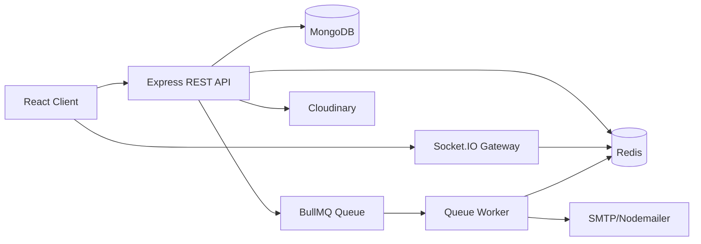

# Báo cáo tổng quan hệ thống ChatRealTime

## 1. Giới thiệu đề tài

ChatRealTime là ứng dụng chat thời gian thực gồm frontend React, backend Node.js/Express, MongoDB, Socket.IO và Redis. Đề tài tập trung vào một hệ thống chat có đầy đủ luồng tài khoản, bạn bè, hội thoại, tin nhắn realtime, quản trị, báo cáo, bảo trì và call signaling.

Lý do chọn đề tài:

- Chat realtime là bài toán thực tế, có yêu cầu đồng thời về frontend, backend, database, realtime và bảo mật.
- Hệ thống có nhiều luồng nghiệp vụ đủ lớn để thể hiện thiết kế module và tối ưu hiệu năng.
- Có cơ hội đo tải, tìm bottleneck và cải thiện bằng Redis, index, cache và worker nền.

Mục tiêu hệ thống:

- Người dùng có thể đăng ký, đăng nhập, xác minh tài khoản, quản lý hồ sơ.
- Người dùng có thể kết bạn, chat 1-1, chat nhóm, gửi ảnh, reaction, seen.
- Hệ thống realtime qua Socket.IO cho message, notification, online/offline và call signaling.
- Admin có dashboard, quản lý user/report/conversation/support/maintenance.
- Backend có lớp bảo mật transport, cache, rate limit, queue và khả năng scale worker.

## 2. Chức năng chính

### Người dùng

- Đăng ký, đăng nhập, refresh token, logout.
- Xác minh email, quên mật khẩu, đổi mật khẩu.
- Cập nhật hồ sơ, avatar, preference hiển thị online.
- Chặn/bỏ chặn người dùng.
- Xóa tài khoản và email xác nhận liên quan.

### Chat realtime

- Chat trực tiếp 1-1.
- Chat nhóm.
- Gửi tin nhắn text, ảnh, reply, reaction.
- Thu hồi/xóa tin nhắn theo cá nhân hoặc mọi người.
- Đánh dấu đã xem và unread count.
- Danh sách hội thoại realtime.

### Bạn bè

- Gửi, nhận, chấp nhận, từ chối, hủy lời mời kết bạn.
- Danh sách bạn bè.
- Gợi ý bạn bè.
- Tích hợp block/report để lọc gợi ý và tương tác.

### Notification và admin realtime

- Emit realtime khi có tin nhắn, lời mời bạn bè, report, support message hoặc thay đổi trạng thái.
- Admin nhận thông tin user/report/support/maintenance theo quyền.

### Report, moderation và support

- Người dùng báo cáo user/message/conversation.
- Admin xem danh sách report, xử lý trạng thái.
- Support conversation hỗ trợ người dùng.
- Blocking document và embedded block state hỗ trợ moderation.

### Maintenance

- Admin bật/tắt maintenance mode.
- User thường bị chặn khi maintenance bật.
- Admin/support có thể bypass theo quyền.
- Có cache Redis/L1 và invalidation khi toggle/update.

### Voice/video call signaling

- Voice/video call 1-1.
- Group voice/video call MVP bằng WebRTC mesh.
- Socket.IO chỉ truyền signaling/state, không truyền audio/video qua backend.
- Hạn chế còn lại: manual E2E nhiều browser thật và scale shared state cho call runtime cần kiểm thử thêm.

## 3. Kiến trúc tổng thể

Giải thích:

- React client gọi REST API để xử lý nghiệp vụ và kết nối Socket.IO để nhận realtime event.
- Express API chứa middleware, route, controller và service theo module.
- MongoDB là source of truth cho user, session, conversation, message, friend, report, maintenance và call session.
- Redis là tầng cache, rate limit, refresh session helper, presence, Socket.IO adapter và backend cho BullMQ.
- BullMQ worker chạy riêng để xử lý email và cleanup jobs, không chặn request API chính.
- Cloudinary/multer xử lý upload ảnh/avatar/media.

## 4. Thiết kế dữ liệu

| Collection/model | Vai trò | Liên hệ/index quan trọng |
| --- | --- | --- |
| `User` | Tài khoản, profile, role, permission, status, preference, blockedUsers | Unique `userName`, unique `email`, `status + createdAt`, search fields |
| `Session` | Refresh session, expiresAt TTL | `userId`, unique `refreshToken`, TTL `expiresAt` |
| `Conversation` | Direct/group/support conversation, participants, lastMessage, unread | `participants.userId + lastMessageAt/updatedAt`, type/support indexes |
| `Message` | Tin nhắn, sender snapshot, reply, reaction, delete flags, call metadata | `conversationId + createdAt`, `senderId + createdAt`, `replyTo.messageId` |
| `Friend` | Quan hệ bạn bè | Unique pair `userA + userB`, thêm index theo `userA/userB + createdAt` |
| `FriendRequest` | Lời mời kết bạn | `from + status + createdAt`, `to + status + createdAt`, unique `from + to` |
| `Report` | Báo cáo vi phạm và snapshot | `status + createdAt`, `reporterId + status + targetType + createdAt` |
| `Blocking` | Quan hệ chặn | Unique `userId + blockedUserId`, `isActive + createdAt` |
| `Maintenance` | Trạng thái bảo trì | Cache/invalidation quan trọng hơn tần suất ghi |
| `AuditLog` | Nhật ký quản trị | `actorId`, `targetUserId`, `action` |
| `AdminDeletionLog` | Log xóa tài khoản bởi admin | `deletedByAdminId + deletedAt`, `targetUserId + deletedAt` |
| `PasswordResetOtp` | OTP đặt lại mật khẩu | TTL index |
| `EmailChangeVerification` | OTP đổi email | TTL index |
| `CallSession` | Phiên voice/video call | participant/status/time indexes tùy truy vấn |

## 5. Luồng xác thực

Luồng login:

1. Client gọi `POST /api/auth/signin`.
2. Backend validate body.
3. Tìm user theo username/email normalized.
4. So sánh mật khẩu bằng bcrypt.
5. Kiểm tra status, email verification và maintenance access.
6. Tạo access token, refresh token/session.
7. Set cookie httpOnly và trả response giữ nguyên contract hiện tại.
8. Emit lifecycle/admin realtime nếu cần.

Các tối ưu liên quan:

- Auth user lookup cache bằng Redis cho user local, verified, active.
- Refresh session helper Redis dùng key hash token, không log raw token.
- Rate limit auth bằng Redis cho login/register/forgot-password.
- Timing logs chỉ bật bằng env debug/load test, không log password/token/cookie.

Hạn chế còn lại:

- Bearer flow vẫn được giữ để tương thích.
- Refresh token chưa rotate.
- Access token vẫn còn trong JSON response theo contract hiện tại.

## 6. Luồng chat realtime

1. Client đăng nhập và kết nối Socket.IO bằng JWT trong auth payload, không dùng query string token.
2. Socket auth verify user và join room riêng theo `userId`.
3. Socket join các room conversation mà user là participant.
4. Khi gửi message, REST/service lưu MongoDB trước.
5. Backend emit event đến conversation room và user room liên quan.
6. Conversation list, unread count, seen state và notification được cập nhật.
7. Redis cache liên quan conversation/friend/admin dashboard được invalidate theo mutation.

Khi chạy nhiều worker:

- `@socket.io/redis-adapter` giúp broadcast/emit xuyên worker.
- Redis presence lưu user -> socketIds và socketId -> userId, tránh phụ thuộc Map local.
- Presence có TTL heartbeat và cleanup stale presence bằng BullMQ job.

## 7. Redis trong hệ thống

Các phần Redis đã làm hoặc đã tổng hợp từ phase report:

- Redis client singleton và helper JSON cache.
- Maintenance config cache L2 Redis.
- Maintenance L1 in-memory cache per worker + single-flight.
- Auth user lookup cache cho signin.
- Refresh session Redis helper.
- Auth rate limit middleware.
- Conversation list cache.
- Friend list, friend request, suggestion cache.
- Admin dashboard cache.
- Socket.IO Redis adapter.
- Redis scalable presence.
- Redis backend cho BullMQ email queue và cleanup queue.

Cache invalidation được thực hiện khi có create/update/delete/send message, friend mutation, admin action, maintenance toggle/update và các thay đổi user/status/role/profile cần thiết.

## 8. MongoDB index, query và pagination

Các điểm chính từ audit:

- Signin dùng `User.findOne({ userName })`; `users.userName` unique index đã phù hợp.
- Forgot/reset/email flow dùng `users.email`; unique index đã phù hợp.
- Conversation list cần index theo `participants.userId` và `lastMessageAt/updatedAt`.
- Message pagination cần `messages.conversationId + createdAt`.
- Friend list cần tối ưu cả nhánh `userA` và `userB`.
- Friend request cần compound index theo `from/to + status + createdAt`.
- Report/admin list cần `status + createdAt`, `targetType + status + createdAt`.
- Block/admin list cần `userId/blockedUserId + isActive + createdAt`.
- Pagination list API cần giới hạn max limit để tránh query lớn.
- Có script `scripts/audit-indexes.js` để kiểm tra index.

## 9. BullMQ background jobs

BullMQ được thiết kế mặc định tắt bằng env để không tạo side effect trong dev:

- `BULLMQ_ENABLED=false`
- `EMAIL_QUEUE_ENABLED=false`
- `QUEUE_WORKER_ENABLED=false`
- `CLEANUP_QUEUE_ENABLED=false`

Job hiện có:

- Email queue: đưa gửi email/OTP/verification sang worker nền, fallback SMTP trực tiếp nếu queue tắt/lỗi.
- `cleanup-stale-presence`: dọn presence Redis stale do socket/worker chết đột ngột.
- `cleanup-old-queue-jobs`: dọn job BullMQ cũ ở trạng thái completed/failed theo retention.

Worker chạy riêng bằng `npm run worker:queues`.

## 10. Bảo mật

Transport Security Phase 1 đã bổ sung:

- Cookie helper dùng chung.
- CORS whitelist cho Express và Socket.IO.
- HTTPS enforcement production có rollback flag.
- Production env validation cho URL HTTPS/WSS.
- Helmet/security headers.
- Không đổi auth response, không bỏ Bearer flow, không rotate refresh token.

Các nguyên tắc bảo mật đang áp dụng:

- Refresh token qua httpOnly cookie.
- Socket.IO dùng auth payload, không truyền token qua query string.
- Không log password/token/cookie/Authorization/OTP/email HTML.
- Redis session helper dùng hash refresh token.
- Redis/Mongo production cần private network, password/ACL/TLS tùy hạ tầng.

Hạn chế còn lại:

- CSP chưa bật đầy đủ vì cần cấu hình riêng cho Swagger, Socket.IO, Cloudinary và getUserMedia.
- Refresh token rotation chưa làm.
- Mongo/Redis production exposure cần kiểm tra khi deploy thật.

## 11. Kết quả kiểm thử

Kết quả tổng hợp từ các report:

- Jest backend nhiều phase: 9 test suites passed, 44 tests passed.
- `node --check` các file backend/queue/socket/presence đã chạy nhiều lần và pass trong các phase liên quan.
- Redis Phase 1 đã xác nhận Redis health, rate limit 429, TTL expiry, maintenance cache hit/miss/invalidate và fail-open trong validation report.
- Transport Security Phase 1 đã pass Jest, có smoke CORS/security headers/Swagger một phần.
- Phase 2A Socket.IO Redis adapter/presence đã pass syntax/Jest nhưng manual multi-tab/cluster smoke chưa chạy đầy đủ.
- Phase 2D.1/2D.2 BullMQ email/cleanup đã pass syntax và Jest; manual Redis worker smoke đầy đủ vẫn cần chạy thêm.

Số liệu login performance đáng chú ý:

| Giai đoạn | VUs | Kết quả chính |
| --- | --- | --- |
| Baseline ban đầu | 100 | p95 khoảng 4.92s-5s, failed khoảng 4.55%-6.25% |
| Phase 1E cluster benchmark | 10 | p95 khoảng 147ms |
| Phase 1E cluster benchmark | 25 | p95 khoảng 913ms |
| Phase 1E cluster benchmark | 50 | p95 khoảng 2.09s |
| Sau Redis auth user lookup cache | 25 | p95 khoảng 146ms, failed 0% |
| Sau Redis auth user lookup cache | 50 | p95 khoảng 272-406ms, còn timeout nhỏ |
| Sau auth cache + maintenance L1 | 40 | p95 khoảng 256ms, failed khoảng 3.24% |
| Sau auth cache + maintenance L1 | 50 | p95 khoảng 275ms, failed khoảng 2.23% |

Không nên phóng đại kết quả: benchmark local chỉ phản ánh môi trường test hiện tại, chưa thay thế production load test đầy đủ.

## 12. Hạn chế còn lại

- Một số manual smoke Redis/BullMQ/Socket.IO multi-worker chưa chạy đầy đủ.
- Queue cleanup không xóa dữ liệu chính như User/Message/Conversation/Report.
- Call runtime vẫn còn phần state cần đánh giá thêm khi scale nhiều instance.
- Login p95 đã cải thiện mạnh nhưng còn failed/timeout nhỏ trong một số kịch bản.
- Production cần monitoring Prometheus/Grafana hoặc APM tương đương.
- `npm audit` từng báo còn vulnerabilities trong dependency tree; chưa chạy audit fix vì có thể đổi dependency ngoài phạm vi.
- CSP, refresh token rotation, cookie-only auth và production deployment hardening còn là hướng phát triển.

## 13. Hướng phát triển

- Chạy full smoke Redis/BullMQ/Socket.IO cluster với nhiều browser/account thật.
- Hoàn thiện observability: metrics, tracing, alert, dashboard.
- Refresh token rotation và revoke session nâng cao.
- CSP production phù hợp Swagger, Socket.IO, Cloudinary và call.
- Notification queue, media cleanup queue, audit log queue.
- Load test message/socket/conversation list, không chỉ login.
- Hoàn thiện deployment production với private MongoDB/Redis network, HTTPS/WSS và backup.
- Cân nhắc SFU nếu group video call cần vượt giới hạn WebRTC mesh MVP.

## 14. Kết luận

ChatRealTime đáp ứng mục tiêu đồ án: có frontend, backend, database, realtime, auth, admin, security, cache, queue và quá trình tối ưu hiệu năng dựa trên số liệu. Hệ thống đã đi xa hơn một app chat cơ bản nhờ có Redis, Socket.IO scale adapter, presence, BullMQ, security hardening và load test.

Tuy vậy, hệ thống chưa nên được gọi là production-ready hoàn toàn nếu chưa hoàn tất smoke test môi trường thật, monitoring, hardening token/CSP, xử lý vulnerabilities và deployment checklist. Đây là nền tảng tốt để tiếp tục phát triển lên môi trường production.

